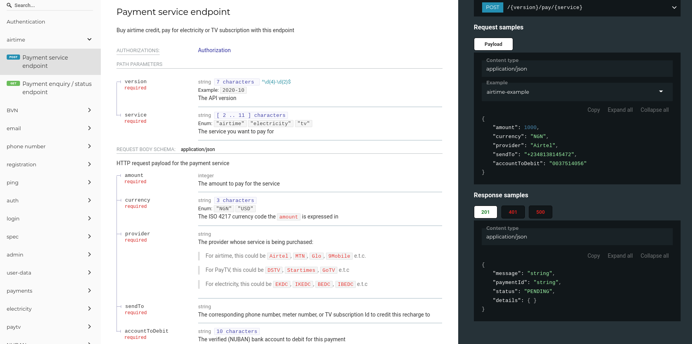

# The EffesEYE Platform API v2020-10

[Go to API Documentation](https://effeseye-api-docs.netlify.app/) | [See The API Spec]()

   

A design-first approach was adopted for the EffesEYE platform APIs. This produces a standards-compliant API specification and interaction contract for the platform. Doing this builds resilience, thoughtfullness, empathy, robustness, and superior developer experience into the product.

> The API is the first user interface in the product

Not only are we able to generate high quality documentation, including code samples and support for code generation for several programming languages, all from the API spec, we are also able to leverage automatic and on-the-fly validation for inbound traffic (HTTP requests) to the EffesEYE platform and outbound traffic (HTTP response) from the EffesEYE platform. 

## Benefits of API Design-first Approach to The EffesEYE Platform

*   Establishes a contract that keeps all integrating systems in sync and in check
*   Empowers the teams (e.g frontend and backend) to work in parallel
*   Enables improved automation, including input/output validation and test automation
*   Prioritises empathy and significantly improves developer experience since a well designed API spec leaves very little room for ambiguity by spec-ing the entire API, down to the data-types and validation contraints for as little as URL parameters

> An API-first approach involves developing APIs that are consistent and reusable, which can be accomplished by using an API description language to establish a contract for how the API is supposed to behave.  Establishing a contract involves spending more time thinking about the design of an API. It also often involves additional planning and collaboration with the stakeholders providing feedback on the design of an API before any code is written - swagger.io
